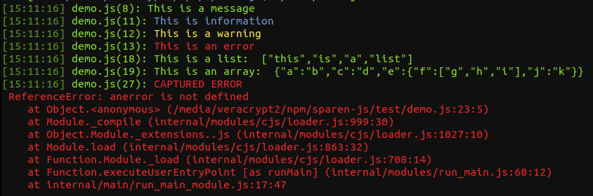
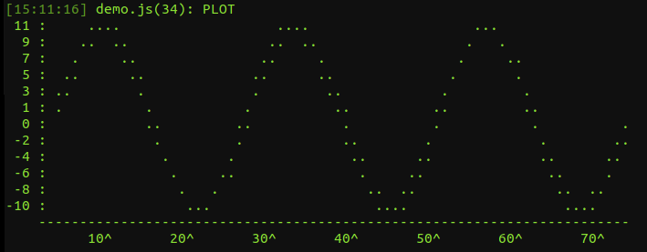
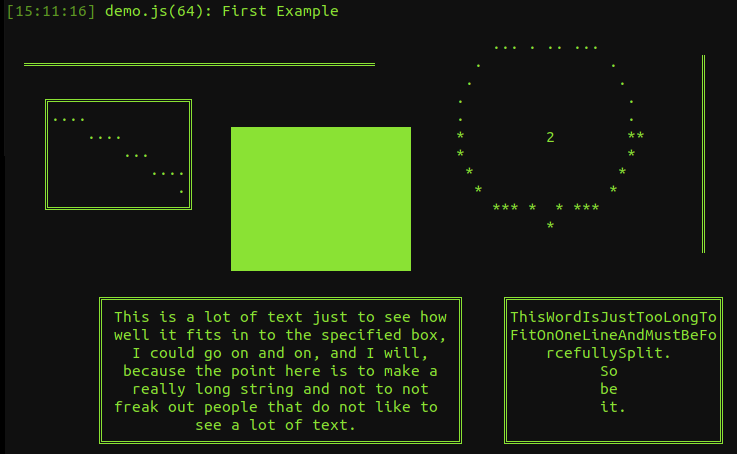
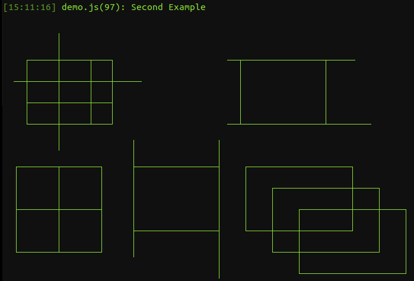

# sparen

Create richer more helpful logs using terminal coloring, file saving,
graph plotting, and ascii drawing.

``` javascript

    const sparen = require('sparen');
    sparen.log('This is a message');

```

---------------------------------------------------------------------
## Table of contents

* [Install](#install)
* [Examples](#examples)
* [References](#references)

&nbsp;

---------------------------------------------------------------------
## Install

    $ npm install sparen

&nbsp;


---------------------------------------------------------------------
## Examples

``` javascript

    const sparen = require('sparen');
    const Log = sparen.log;

    sparen.log('This is a message');

    sparen.addLogFilters('info:blue,warning:yellow,error:red');
    Log('This is information');
    Log('This is a warning');
    Log('This is an error');

    let lst = ['this', 'is', 'a', 'list'];
    let arr = {'a': 'b', 'c': 'd', 'e': {'f': ['g', 'h', 'i'], 'j': 'k'}};

    Log('This is a list: ', lst);
    Log('This is an array: ', arr);

    try
    {
        thisis = anerror;
    }
    catch(e)
    {
        Log('CAPTURED ERROR', e);
    }

```



``` javascript

    let plot = sparen.initArray(200, (i)=>Math.sin(i * Math.PI * 6 / 200) * 10);
    Log('PLOT\n' + sparen.plotArray(plot) + "\n");

```



``` javascript

    let canv = new sparen.Canvas(80, 25, 2);

    canv.line(2, 2, 40, 2);
    canv.line(77, 2, 77, 12);

    canv.rect(4, 4, 20, 10);
    canv.line(5, 5, 19, 9);

    canv.fillRect(25, 6, 45, 14);

    canv.circle(60, 6, 5);
    canv.arc(60, 6, 5, 0, 180, '*');

    canv.text(60, 6, "2");

    canv.rect(10, 15, 50, 23);
    canv.textBox(11, 15, 49, 23, 'This\tis a lot of text just to see how well it fits in to the'
                                +' specified box, I could go on and on, and I will, because the'
                                +' point here is to make a really long string and not to not'
                                +' freak out people that do not like to see a lot of text.');

    canv.rect(55, 15, 79, 23);
    canv.textBox(55, 15, 79, 23, 'ThisWordIsJustTooLongToFitOnOneLineAndMustBeForcefullySplit.\n'
                                +' So \n be \n it.');

    Log("First Example\n" + canv.toString());

```



``` javascript

    canv = new sparen.Canvas(80, 25, 1);

    canv.rect(4, 4, 20, 10);

    canv.line(2, 6, 25, 6);
    canv.line(4, 8, 20, 8);

    canv.line(10, 2, 10, 12);
    canv.line(16, 4, 16, 10);

    canv.rect(44, 4, 60, 10);
    canv.line(42, 4, 65, 4);
    canv.line(42, 10, 68, 10);

    canv.rect(24, 14, 40, 20);
    canv.line(24, 12, 24, 22);
    canv.line(40, 12, 40, 24);

    canv.rect(45, 14, 65, 20);
    canv.rect(50, 16, 70, 22);
    canv.rect(55, 18, 75, 24);

    canv.rect(2, 14, 10, 18);
    canv.rect(10, 14, 18, 18);
    canv.rect(2, 18, 10, 22);
    canv.rect(10, 18, 18, 22);

    Log("Second Example\n" + canv.toString());

```



&nbsp;


---------------------------------------------------------------------
## References

- Node.js
    - https://nodejs.org/

- npm
    - https://www.npmjs.com/
